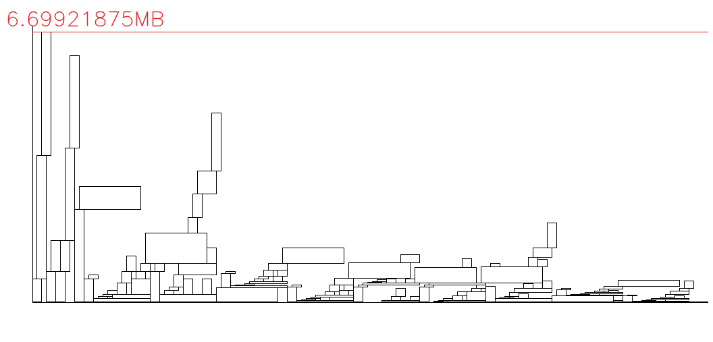

### Memory Allocation Design

- **Q1.** How do you compare the performance of two memory allocation policies?
    - **A1.** 我覺得 memory space 使用的 peak 是一個很重要的指標，因為要是目前的 Hardware 不能滿足這個 peak ，那就無法正常執行。接下來才是看哪個 policy 能讓 menmory allocation 的分布平均，以及 allocation 的位置是否能 minimize the fragmentation。

- **Q2.** What will be the upper bound of the performance? In HW22-2-2, assuming you have the full knowledge of all the tensors that you want to do memory allocations ahead of time, how do you implement an `optimal` memory allocation policy as your upper bound for comparison?
    - **A2.** 我想這個有點像 compiler 裡面的 `Register Interference Graph` ， 我的理解是可以嘗試用 greedy 的方式來解 `Interval-graph Coloring Problem` ，如下圖所示
    
    上圖假設每一個 operator 需要的 memory space 一樣，當然實際情況不是如此，我們可以針對每一個 node 將上 weight，代表不同的 operator 有不同的 memory space。
    對應關係如下:
        -  operator dependency -> edge
        -  a memory space of a operator -> a node
        -  total number of memory space -> total number of color 
        
        我們可以假設目前的 operator 之間有關係我們就連成一條 edge，並假設我們現在有 N 段空間 (這邊每一段空間是固定的，且一段空間用一種顏色表示)，像上面的圖有 2 段空間。現在用 greedy 的方式來將空間(顏色) 指定給 operator(node)，如果我們可以用 N 種顏色來填滿這個 graph，代表 這些 operator 可以用 N 段 memory space 完成，逐步添加 N 便可以找到 upper bound。
    
        但以上算法有一個問題，就是忽略了 fragmentation 的排列問題，所以我覺得應該還是要將 Live Range 畫出來，並將重疊當中最長的移到空位或是最後面，讓每一段時間的 data 盡量塞滿 memory space ，可以把左邊的想成不同的 operator。
    


### Design your cost function
In this homework, you have to design your cost function to estimate the cost of a subgraph in computation. We prepare several subgraphs ([GitLab Link - `model/hw1`]()) as the benchmark.
* **Q3** : Please elaborate how you design the cost fucntion.
    * **A3** :我並沒有添加額外的內容，而是參考 `analysis_scalar_memory_dependent()`依照 Scalar-based execution 方式做計算，內容如下:
        - CPU cycle:LW、SW、address 位置計算、每筆operator 的 cycle
        - memory : 全部 tensor 的靜態配置 

#### testbench #1 : tb1.onnx : one operator - `Conv`
1. [lab22/src/cost/anal/op/Conv.py](https://course.playlab.tw/git/Jim0628/lab22/-/blob/main/src/cost/anal/op/Conv.py)
```python=
from . import *

def analysis(model:onnx.ModelProto,layout:str, node:onnx.NodeProto, memoryTable:Optional[list] = None, csvPath:Optional[str] = None) -> tuple([int, dict,list]):
    return analysis_scalar_memory_dependent(model,layout,node, memoryTable, csvPath)
    # return analysis_matrix_memory_reallocated(model,layout,node)


def calc_load_count(h_out, w_out, k_h, k_w, stride_h, stride_w, pad_top, pad_left, dilation_h, dilation_w, h_in, w_in, n, c_in, c_out):
    valid_positions = (
        1
        for h in range(h_out)
        for w in range(w_out)
        for kh in range(k_h)
        for kw in range(k_w)
        if 0 <= (h * stride_h - pad_top + kh * dilation_h) < h_in
        and 0 <= (w * stride_w - pad_left + kw * dilation_w) < w_in
    )
    count = sum(valid_positions)
    load = count * n * c_in * c_out
    return load

def analysis_scalar_memory_dependent(model:onnx.ModelProto,layout:str, node:onnx.NodeProto, memoryTable:Optional[list] = None, csvPath:Optional[str] = None) -> tuple([int, dict,list]):
    memoryRequest = 0
    _, X = get_value_info(node.input[0], model)
    
    _, W = get_initilizer(node.input[1], model)
    _, Y = get_value_info(node.output[0], model)
    
    if len(node.input) == 3:
        _, B = get_initilizer(node.input[2], model)
    
    dimX = [a.dim_value for a in X.type.tensor_type.shape.dim]
    dimY = [a.dim_value for a in Y.type.tensor_type.shape.dim]
    dimW = W.dims
    if layout == "NHWC":
        dimX[1], dimX[3] = dimX[3], dimX[1]
        dimW[1], dimW[3] = dimW[3], dimW[1]
        dimY[1], dimY[3] = dimY[3], dimY[1] 
    typeX = X.type.tensor_type.elem_type    
    typeY = Y.type.tensor_type.elem_type
    typeW = W.data_type
    
    staticMemX = DATA_SIZE_DTYPE[typeX]
    staticMemY = DATA_SIZE_DTYPE[typeY]
    staticMemW = DATA_SIZE_DTYPE[typeW]
    
    for dim in dimX: staticMemX *= dim
    for dim in dimY: staticMemY *= dim
    for dim in dimW: staticMemW *= dim
    
    
    attr_dict = get_attribute(node.attribute)

    dilations = attr_dict.get("dilations", [1, 1])
    pads = attr_dict.get("pads", [0, 0, 0, 0])
    strides = attr_dict.get("strides", [1, 1])
    
    stride_h, stride_w = strides
    dilation_h, dilation_w = dilations
    pad_top, pad_left, pad_bottom, pad_right = pads
    
       # Kernel size
    k_cout, k_cin, k_h, k_w = dimW

    # Input size
    n, c_in, h_in, w_in = dimX
    n_out, c_out, h_out, w_out = dimY

    

    load = calc_load_count(h_out, w_out, k_h, k_w, stride_h, stride_w, pad_top, pad_left, dilation_h, dilation_w, h_in, w_in, n, c_in, c_out)


    # loop = dimY[0] * dimY[1] * dimY[2] * dimY[3] * dimW[1] * dimW[2] * dimW[3] 
    
    loop = load
    
    # SW instruction :
    store = dimY[0] * dimY[1] * dimY[2] * dimY[3]
    # LW instruction :
    # load = loop
    # Create Address for input kernel output
    create_input_pivot = 3 + 2 # 3 (multiply) + 2 (addition) 
    create_kernel_address =  3 + 3 # 3 (multiply) + 3 (addition)
    create_input_address =  2 + 3 + (create_input_pivot / dimW[1] * dimW[2] * dimW[3])# 2 (multiply) + 3 (addition)
    create_output_address = 2 + 3 # 2 (multiply) + 3 (addition)
    create_temp = 2 + 3 # 2 (multiply) + 3 (addition)
    # create Input
    create_input = (config.DATA_LATENCY + create_input_address) * load
    # Create Kernel
    create_kernel = (config.DATA_LATENCY + create_kernel_address) * load
    # Create Output
    create_output = (config.DATA_LATENCY + create_output_address) * store + create_temp * loop
    # Number of branch
    branch_count = 0
    # CPU instruction count :
    cycle = create_input + create_kernel + create_output + branch_count
    # Memory Requirement
    memory = staticMemX + staticMemY + staticMemW
    

    ######### memory Management #########
    request, memoryTable = tool.malloc(node.output[0], staticMemY // 8 , memoryTable)
    memoryRequest += request
    tool.dump_csv(csvPath=csvPath, memoryTable=memoryTable, memMAX=config.MEMORY_SIZE_IN_LAB16_3+1, second=cycle)
    # for ipt in node.input:
    #     memoryTable = tool.free(ipt, memoryTable)
    memoryTable = tool.free(node.input[0], memoryTable)
    ######### memory Management #########
    return memoryRequest, {"memory" : memory / 8192, "cycle":int(cycle)}, memoryTable

```
2. result : (screenshot)


* **Q4** : Please explain how you design the analytical model for a **convolution** operator.  What attributes or information are taken into consideration during this design process?
    - **A4.**
    我這邊比起原本多考慮了 padding 、 dilations 、 strides 的計算，並這些計算拉到 `calc_load_count()` 函數來做，其他部分維持不變。 

#### testbench #2 : tb2.onnx : three consecutive operators  - `Conv` + `Relu` + `MaxPool`
2. [lab22/src/cost/anal/op/Relu.py](https://course.playlab.tw/git/Jim0628/lab22/-/blob/main/src/cost/anal/op/Relu.py)
```python=
from . import *

def analysis(model:onnx.ModelProto,layout:str, node:onnx.NodeProto, memoryTable:Optional[list] = None, csvPath:Optional[str] = None) -> tuple([int, dict,list]):
    memory = 0
    cycle = 0
    memoryRequest = 0
    
    _, X = get_value_info(node.input[0], model)
    _, Y = get_value_info(node.output[0], model)
    dimX = [a.dim_value for a in X.type.tensor_type.shape.dim]
    dimY = [a.dim_value for a in Y.type.tensor_type.shape.dim]
    if layout == "NHWC":
        dimX[1], dimX[3] = dimX[3], dimX[1]
        dimY[1], dimY[3] = dimY[3], dimY[1] 
    typeX = X.type.tensor_type.elem_type    
    typeY = Y.type.tensor_type.elem_type
    
    staticMemX = DATA_SIZE_DTYPE[typeX]
    staticMemY = DATA_SIZE_DTYPE[typeY]
    
    for dim in dimX: staticMemX *= dim
    for dim in dimY: staticMemY *= dim
    
    
    # SW instruction :
    store = dimY[0] * dimY[1] * dimY[2] * dimY[3]
    # LW instruction :
    load = dimX[0] * dimX[1] * dimX[2] * dimX[3]
    
    
    create_input_address =  2 + 3
    create_output_address = 2 + 3
    
    # create Input
    create_input = (config.DATA_LATENCY + create_input_address) * load
    
    # max()
    create_temp = load # if max() is 1 cycles
    
    # Create Output
    create_output = (config.DATA_LATENCY + create_output_address) * store
    
    # CPU instruction count :
    cycle = create_input + create_temp + create_output 
    
    # Memory Requirement
    memory = staticMemX + staticMemY
    
    # float x = input[i];
    # float y = max(x, 0);
    # output[i] = y;

    ######### memory Management #########
    request, memoryTable = tool.malloc(node.output[0], staticMemY // 8 , memoryTable)
    memoryRequest += request
    _ = tool.dump_csv(csvPath=csvPath, memoryTable=memoryTable, memMAX=config.MEMORY_SIZE_IN_LAB16_3+1, second=cycle)
    # for ipt in node.input:
    #     memoryTable = tool.free(ipt, memoryTable)
    memoryTable = tool.free(node.input[0], memoryTable)
    ######### memory Management #########
    return memoryRequest, {"memory" : memory / 8192, "cycle":int(cycle)}, memoryTable
```
* **Q5** : Please explain how you design the analytical model for a **relu** operator.  What attributes or information are taken into consideration during this design process?
    - **A5.** 考慮到不是 in-place 的計算，所以還是有計算 Memory 。
        - Cycle 計算：考慮三個部分——輸入資料的讀取（load）、ReLU 運算本身（max(x, 0)，假設每次運算為 1 cycle）、以及結果的寫入（store）。每個操作還包含資料存取位址的產生，因此將其乘上對應的資料數量後加總，得出總 cycle 數。
        - Memory 計算：計算輸入張量（staticMemX）與輸出張量（staticMemY）的記憶體需求，兩者加總即為此操作所需的總記憶體。
3. [lab22/src/cost/anal/op/MaxPool.py](https://course.playlab.tw/git/Jim0628/lab22/-/blob/main/src/cost/anal/op/MaxPool.py)
```python=
from . import *

def analysis(model:onnx.ModelProto,layout:str, node:onnx.NodeProto, memoryTable:Optional[list] = None, csvPath:Optional[str] = None) -> tuple([int, dict,list]):
    memory = 0
    cycle = 0
    memoryRequest = 0
    
    _, X = get_value_info(node.input[0], model)
    _, Y = get_value_info(node.output[0], model)
    dimX = [a.dim_value for a in X.type.tensor_type.shape.dim]
    dimY = [a.dim_value for a in Y.type.tensor_type.shape.dim]
    if layout == "NHWC":
        dimX[1], dimX[3] = dimX[3], dimX[1]
        dimY[1], dimY[3] = dimY[3], dimY[1] 
    typeX = X.type.tensor_type.elem_type    
    typeY = Y.type.tensor_type.elem_type
    
    staticMemX = DATA_SIZE_DTYPE[typeX]
    staticMemY = DATA_SIZE_DTYPE[typeY]
    
    for dim in dimX: staticMemX *= dim
    for dim in dimY: staticMemY *= dim
    
    
    attr_dict = get_attribute(node.attribute)

    # ceil_mode = attr_dict.get("ceil_mode")
    kernel_shape = attr_dict.get("kernel_shape")
    # pads = attr_dict.get("pads")
    # strides = attr_dict.get("strides")

    
    # print(kernel_shape)

    
    # SW instruction :
    store = dimY[0] * dimY[1] * dimY[2] * dimY[3]
    # LW instruction :
    load = dimX[0] * dimX[1] * dimX[2] * dimX[3]
    
    
    create_input_address =  2 + 3
    create_output_address = 2 + 3
    
    # create Input
    create_input = (config.DATA_LATENCY + create_input_address) * load
    
    # maxpool()
    create_temp = (kernel_shape[0]*kernel_shape[1] - 1) * store  #if compaere is one cycles
    
    # Create Output
    create_output = (config.DATA_LATENCY + create_output_address) * store
    
    # CPU instruction count :
    cycle = create_input + create_temp + create_output 
    
    # Memory Requirement
    memory = staticMemX + staticMemY

    ######### memory Management #########
    request, memoryTable = tool.malloc(node.output[0], staticMemY // 8 , memoryTable)
    memoryRequest += request
    _ = tool.dump_csv(csvPath=csvPath, memoryTable=memoryTable, memMAX=config.MEMORY_SIZE_IN_LAB16_3+1, second=cycle)
    # for ipt in node.input:
    #     memoryTable = tool.free(ipt, memoryTable)
    memoryTable = tool.free(node.input[0], memoryTable)
    ######### memory Management #########
    return memoryRequest, {"memory" : memory / 8192, "cycle":int(cycle)}, memoryTable
```
* **Q6** : Please explain how you design the analytical model for a **maxpool** operator.  What attributes or information are taken into consideration during this design process?
    - **A6.** 需要考慮的是 dimX、 dimY、 kernel_shape，資料類型大小，這邊的 Max Pool 運算為每個輸出元素需要進行 (kernel_height × kernel_width - 1) 次比較。所以整體為 `(kernel_shape[0] × kernel_shape[1] - 1) × 輸出元素個數`，其他與前面類似。 

其他的我貼上相關連結
- [Add.py](https://course.playlab.tw/git/Jim0628/lab22/-/blob/main/src/cost/anal/op/Add.py)
- [Flatten.py](https://course.playlab.tw/git/Jim0628/lab22/-/blob/main/src/cost/anal/op/Flatten.py)
- [Gemm.py](https://course.playlab.tw/git/Jim0628/lab22/-/blob/main/src/cost/anal/op/Gemm.py)
- [GlobalAveragePool.py](https://course.playlab.tw/git/Jim0628/lab22/-/blob/main/src/cost/anal/op/GlobalAveragePool.py)


* **Q7** : what if we choose to fuse these operators together, would it be necessary to redesign the cost function? What are the differences between a fused model and an unfused model when you design the cost fucntion?
    - **A7.** 需要重新處理。最直觀的是 fuse 之後 data 不用重新 load ，例如 Lab 21 我們將 Conv2D 與 BatchNormalization 融合計算，這樣只需要每組數字 Load 一次 ，做完 Conv2D 與 BatchNormalization 之後 store 回去，減少資料搬移的時間。且如果是 Conv 和 Add 融合 ， 可以將 bias 用 ADD 取代 ， 減少運算量 。因此在資料搬移、記憶體存取與運算量都會有所改變，需要重新設計 cost fucntion。


### Memory allocation policy

Please use [ResNet50 - `model/format-v7/resnet50-v7.onnx`]() and [GoogleNet - `model/format-v8/googlenet-v8.onnx`]() as your benchmarks for both HW22-2-1 and HW22-2-2
#### Try to Propose a new memory allocation policy that outperforms BestHit
1. first you need to modify `lab22/src/management/policy.py` code
```python=
from .hit_policy import bestHit, firstHit, excellentHit

def hit(memoryTable:list,memory:int,memory_MAX:int, hit_policy:str)->int:
    

    hit_list = {
        "bestHit" : bestHit.hit, 
        "firstHit": firstHit.hit,
        "excellentHit": excellentHit.hit
        }
    if hit_policy not in hit_list.keys():
        hit_policy = "bestHit"
    return hit_list[hit_policy](memoryTable=memoryTable,memory=memory,memory_MAX=memory_MAX)


```
2. modify the function `malloc()` defined in `lab22/src/management/tool.py`
```python=
def malloc(tensorName: str, tensorSize: int, memoryTable: list,opt_max:int) -> tuple([int, list]):
    pivot = policy.hit(memoryTable, tensorSize, MEMORY_SIZE + 1, hit_policy="FirstHit")  # 32MB + 1
    # print(f"tensorName: {tensorName}, pivot: {pivot}, tensorSize: {tensorSize}")
    if(len(memoryTable) == 1 ):
    
            # print("len(memoryTable) ")
            nBlk = {
                "valid": 0,
                "address": opt_max ,
                "size": memoryTable[0]['size'] - opt_max,
                "tensor": memoryTable[0]['tensor']
            }
            
            memoryTable[0]['size'] = opt_max
            
            memoryTable.insert(pivot + 1, nBlk)
            # print(memoryTable)
    

    if pivot == -1:
        # print(f"Out of Memory : {tensorName} : {tensorSize / 1024} KB")
        if memoryTable[-1]['valid'] == 1:
            return tensorSize, memoryTable
        else:
            return tensorSize - memoryTable[-1]["size"], memoryTable
    
    else:
        oBlk = memoryTable[pivot]
        threshold = oBlk['size'] * 0.2  
            
        
        if tensorSize < threshold: 
            nBlk = {
                "valid": 1,
                "address": oBlk['address'],
                "size": tensorSize,
                "tensor": tensorName
            }
            oBlk['address'] += tensorSize
            oBlk['size'] -= tensorSize
            memoryTable.insert(pivot, nBlk)
        else:
            
            nBlk = {
                "valid": 1,
                "address": oBlk['address'] + oBlk['size'] - tensorSize,
                "size": tensorSize,
                "tensor": tensorName
            }
            oBlk['size'] -= tensorSize
            memoryTable.insert(pivot + 1, nBlk)
        
        # print(memoryTable)

        return 0, memoryTable

```
3. create your hit policy [lab22/src/management/hit_policy/excellentHit.py](https://course.playlab.tw/git/Jim0628/lab22/-/blob/main/src/management/hit_policy/excellentHit.py)
```python=
def hit(memoryTable:list,memory:int,memory_MAX:int)->int:
    hit_index = -1
    bestRecord = memory_MAX
    for cnt in range(len(memoryTable)):
        block = memoryTable[cnt]
        if (block['valid'] == 1):
            continue
        else:
            if block['size'] >= memory and block['size'] < bestRecord:
                hit_index = cnt
                bestRecord = block['size']
    return hit_index
```
4. run the code to test the Resnet50
    ```shell=
    ## memory management 
    ### main.py
    #### -m : input onnx model
    #### -l : layout - NCHW
    #### -f : function - management
    ### management
    $ python3 main.py -l NCHW -m out/resnet50-v14/resnet50-v14.onnx -f management

    ## show the memory requirement
    ### gen_graph.py
    #### -c: input csv file
    #### -o: output memory management graph
    $ python3 gen_graph.py -c out/resnet50-v14/memory.csv -o out/resnet50-v14/memory_allocation.png

    ```
5. If you want to have a more aggressive memory management, you can modify the function -`malloc()`. (In lab, after we use hit-policy to choose the free block, we will map the data from the top of this free block.)

##### Memory Allocation Timeline Diagram
- Diagram #1 ResNet50(resnet50-v14.onnx)

    **BestHit policy**
    
- Diagram #2 GoogleNet(googlenet-v12_no_dropout.onnx)

    **BestHit policy**
    
    
- Diagram #3 ResNet50(resnet50-v14.onnx)
    **excellentHit policy**
    

- Diagram #4 GoogleNet(googlenet-v12_no_dropout.onnx)
    **excellentHit policy**
    


#### Upper Bound Analysis - Optimal Memory Allocation Policy
```python= 
def opt_manager(model:onnx.ModelProto, operatorPath:str, csvPath:str) -> int:
    
    activative_tensor, static_tensor = create_tensor_dict(model)
    nodeList, nodeDict = create_operator_list_dict(model, static_tensor)
    topo_order = scheduler(nodeDict, nodeList)
    
    # 找出每個 tensor 第一次被產生(作為 output)與最後一次被使用(作為 input)的 operator index
    tensor_live_range = {}
    
    # 紀錄 tensor 首次產生與最後使用的 step
    for step, node_idx in enumerate(topo_order):
        op_name = nodeList[node_idx]
        inputs = nodeDict[op_name]['input']
        outputs = nodeDict[op_name]['output']
        
        # tensor 第一次產生時間 (output)
        for t in outputs:
            if t not in tensor_live_range:
                tensor_live_range[t] = {'start': step, 'end': step}
            else:
                # 防止初始化就出現 !
                if step < tensor_live_range[t]['start']:
                    tensor_live_range[t]['start'] = step
        
        # tensor 最後使用時間 (input)
        for t in inputs:
            if t not in tensor_live_range:
                tensor_live_range[t] = {'start': step, 'end': step}
            else:
                if step > tensor_live_range[t]['end']:
                    tensor_live_range[t]['end'] = step
    
    # 對模型輸入 tensor，視為從 step -1 開始 active 
    model_inputs = [t.name for t in model.graph.input if t.name not in [x.name for x in model.graph.initializer]]
    for t in model_inputs:
        if t not in tensor_live_range:
            tensor_live_range[t] = {'start': -1, 'end': -1}
        else:
            tensor_live_range[t]['start'] = -1
    
    # 計算每個時間點 active  tensor 總大小
    max_mem = 0
    # time 從 -1 到最大 step
    max_step = max(topo_order) if len(topo_order) > 0 else 0
    for time in range(-1, len(topo_order)):
        current_mem = 0
        for tensor, live in tensor_live_range.items():
            if live['start'] <= time <= live['end']:
                size = tool.operator_Mem_Bytes(activative_tensor[tensor])
                current_mem += size
        if current_mem > max_mem:
            max_mem = current_mem
    
    print(f"Optimal memory lower bound (bytes): {max_mem}")
    
    return max_mem
```

輸出如下


##### Program Description

- opt_manager()
    HW 22-2-2 的 這個 opt_manager 函數會模擬整個模型的執行流程，分析每個 tensor 在執行過程中何時產生、何時被用完(live time)，並根據這些資訊計算每個時間點 active tensor 的總記憶體使用量，最後找出其中的最大值，作為理想狀況下的最小記憶體需求，也就是最佳配置的下界，用來評估目前記憶體分配策略的效能。
- Workflow
    以下將按照順序說明我的流程
    - 計算 Upper Bound 
        會用上面提到的 `opt_manager()` 計算最小的 memory 使用量
    - 切 memoryTabl
        根據 Upper Bound 為中線，將原本的 memoryTabl 切成兩半，目的是為了讓下面的 `excellentHit` Policy 能集中在 Upper Bound 下面
    - 利用 `excellentHit`
        我的 `excellentHit` 與 `bestHit`  相同
    - 根據 tensorSize 的分配位置
        用 `excellentHit` 找到 pivote 之後，我會判斷 tensorSize 的大小，如果比較小我希望越接近 x 軸越好，反之如果是比較大的我希望越接近  Upper Bound 越好，
        
    我覺得原本的都是從下面開始排，但有些 tensorSize 短的其實可以放到上面的空間，因此這個 Program 設計的概念是盡量讓大與小的 tensorSize 分開，集中在該段 memoryTabl 的兩側，就結果來看這個策略在兩個 model 都可以達到最佳化的效果。

### Optimize NN Model Scheduler Design for GoogleNet
In this HW, you should create a scheduler for [GoogleNet - `model/format-v8/googlenet-v8.onnx`]() and map it into 4 PEs.

- Temporal Partition & Spatial Partition
這邊我切的方式是按照既有的內容來處理，總共有以下五種 subgraph


1. $Conv => ReLU => MaxPool$ (原本就有)


2. $Conv => ReLU$ (原本就有)


3. $LRN$ (切 W)


4. $MaxPool$(切 C)


5. $AveragePool => Reshape => Gemm$


### Scheduling to all PEs
```python=
python3 googlenet_4PE_subgraph.py
```
以下是執行後的結果
```txt
|  ------------------------------------------------------------------------  |
|        PE0        |       PE1        |       PE2        |       PE3        |
|  ========================================================================  |
|    Node_0_PE_0    |   Node_0_PE_1    |   Node_0_PE_2    |   Node_0_PE_3    |
|                              /concat/concat/0                              |
|                               /split/split/1                               |
|  ========================================================================  |
|    Node_1_PE_0    |   Node_1_PE_1    |   Node_1_PE_2    |   Node_1_PE_3    |
|                              /concat/concat/1                              |
|  ========================================================================  |
|    Node_2_PE_0    |   Node_2_PE_1    |   Node_2_PE_2    |   Node_2_PE_3    |
|                              /concat/concat/2                              |
|  ========================================================================  |
|    Node_3_PE_0    |   Node_3_PE_1    |   Node_3_PE_2    |   Node_3_PE_3    |
|                              /concat/concat/3                              |
|                               /split/split/4                               |
|  ========================================================================  |
|    Node_4_PE_0    |   Node_4_PE_1    |   Node_4_PE_2    |   Node_4_PE_3    |
|                              /concat/concat/4                              |
|                               /split/split/5                               |
|  ========================================================================  |
|    Node_5_PE_0    |   Node_5_PE_1    |   Node_5_PE_2    |   Node_5_PE_3    |
|                              /concat/concat/5                              |
|                              /split/split/11                               |
|  ========================================================================  |
|    Node_11_PE_0   |   Node_11_PE_1   |   Node_11_PE_2   |   Node_11_PE_3   |
|                             /concat/concat/11                              |
|  ========================================================================  |
|    Node_12_PE_0   |   Node_12_PE_1   |   Node_12_PE_2   |   Node_12_PE_3   |
|                             /concat/concat/12                              |
|  ========================================================================  |
|    Node_9_PE_0    |   Node_9_PE_1    |   Node_9_PE_2    |   Node_9_PE_3    |
|                              /concat/concat/9                              |
|  ========================================================================  |
|    Node_10_PE_0   |   Node_10_PE_1   |   Node_10_PE_2   |   Node_10_PE_3   |
|                             /concat/concat/10                              |
|  ========================================================================  |
|    Node_7_PE_0    |   Node_7_PE_1    |   Node_7_PE_2    |   Node_7_PE_3    |
|                              /concat/concat/7                              |
|  ========================================================================  |
|    Node_8_PE_0    |   Node_8_PE_1    |   Node_8_PE_2    |   Node_8_PE_3    |
|                              /concat/concat/8                              |
|  ========================================================================  |
|    Node_6_PE_0    |   Node_6_PE_1    |   Node_6_PE_2    |   Node_6_PE_3    |
|                              /concat/concat/6                              |
|                                 Concat_23                                  |
|                              /split/split/19                               |
|  ========================================================================  |
|    Node_19_PE_0   |   Node_19_PE_1   |   Node_19_PE_2   |   Node_19_PE_3   |
|                             /concat/concat/19                              |
|  ========================================================================  |
|    Node_20_PE_0   |   Node_20_PE_1   |   Node_20_PE_2   |   Node_20_PE_3   |
|                             /concat/concat/20                              |
|  ========================================================================  |
|    Node_17_PE_0   |   Node_17_PE_1   |   Node_17_PE_2   |   Node_17_PE_3   |
|                             /concat/concat/17                              |
|  ========================================================================  |
|    Node_18_PE_0   |   Node_18_PE_1   |   Node_18_PE_2   |   Node_18_PE_3   |
|                             /concat/concat/18                              |
|  ========================================================================  |
|    Node_15_PE_0   |   Node_15_PE_1   |   Node_15_PE_2   |   Node_15_PE_3   |
|                             /concat/concat/15                              |
|  ========================================================================  |
|    Node_16_PE_0   |   Node_16_PE_1   |   Node_16_PE_2   |   Node_16_PE_3   |
|                             /concat/concat/16                              |
|  ========================================================================  |
|    Node_14_PE_0   |   Node_14_PE_1   |   Node_14_PE_2   |   Node_14_PE_3   |
|                             /concat/concat/14                              |
|                                 Concat_37                                  |
|                              /split/split/22                               |
|  ========================================================================  |
|    Node_22_PE_0   |   Node_22_PE_1   |   Node_22_PE_2   |   Node_22_PE_3   |
|                             /concat/concat/22                              |
|                              /split/split/28                               |
|  ========================================================================  |
|    Node_28_PE_0   |   Node_28_PE_1   |   Node_28_PE_2   |   Node_28_PE_3   |
|                             /concat/concat/28                              |
|  ========================================================================  |
|    Node_29_PE_0   |   Node_29_PE_1   |   Node_29_PE_2   |   Node_29_PE_3   |
|                             /concat/concat/29                              |
|  ========================================================================  |
|    Node_26_PE_0   |   Node_26_PE_1   |   Node_26_PE_2   |   Node_26_PE_3   |
|                             /concat/concat/26                              |
|  ========================================================================  |
|    Node_27_PE_0   |   Node_27_PE_1   |   Node_27_PE_2   |   Node_27_PE_3   |
|                             /concat/concat/27                              |
|  ========================================================================  |
|    Node_24_PE_0   |   Node_24_PE_1   |   Node_24_PE_2   |   Node_24_PE_3   |
|                             /concat/concat/24                              |
|  ========================================================================  |
|    Node_25_PE_0   |   Node_25_PE_1   |   Node_25_PE_2   |   Node_25_PE_3   |
|                             /concat/concat/25                              |
|  ========================================================================  |
|    Node_23_PE_0   |   Node_23_PE_1   |   Node_23_PE_2   |   Node_23_PE_3   |
|                             /concat/concat/23                              |
|                                 Concat_52                                  |
|                              /split/split/36                               |
|  ========================================================================  |
|    Node_36_PE_0   |   Node_36_PE_1   |   Node_36_PE_2   |   Node_36_PE_3   |
|                             /concat/concat/36                              |
|  ========================================================================  |
|    Node_37_PE_0   |   Node_37_PE_1   |   Node_37_PE_2   |   Node_37_PE_3   |
|                             /concat/concat/37                              |
|  ========================================================================  |
|    Node_34_PE_0   |   Node_34_PE_1   |   Node_34_PE_2   |   Node_34_PE_3   |
|                             /concat/concat/34                              |
|  ========================================================================  |
|    Node_35_PE_0   |   Node_35_PE_1   |   Node_35_PE_2   |   Node_35_PE_3   |
|                             /concat/concat/35                              |
|  ========================================================================  |
|    Node_32_PE_0   |   Node_32_PE_1   |   Node_32_PE_2   |   Node_32_PE_3   |
|                             /concat/concat/32                              |
|  ========================================================================  |
|    Node_33_PE_0   |   Node_33_PE_1   |   Node_33_PE_2   |   Node_33_PE_3   |
|                             /concat/concat/33                              |
|  ========================================================================  |
|    Node_31_PE_0   |   Node_31_PE_1   |   Node_31_PE_2   |   Node_31_PE_3   |
|                             /concat/concat/31                              |
|                                 Concat_66                                  |
|                              /split/split/44                               |
|  ========================================================================  |
|    Node_44_PE_0   |   Node_44_PE_1   |   Node_44_PE_2   |   Node_44_PE_3   |
|                             /concat/concat/44                              |
|  ========================================================================  |
|    Node_45_PE_0   |   Node_45_PE_1   |   Node_45_PE_2   |   Node_45_PE_3   |
|                             /concat/concat/45                              |
|  ========================================================================  |
|    Node_42_PE_0   |   Node_42_PE_1   |   Node_42_PE_2   |   Node_42_PE_3   |
|                             /concat/concat/42                              |
|  ========================================================================  |
|    Node_43_PE_0   |   Node_43_PE_1   |   Node_43_PE_2   |   Node_43_PE_3   |
|                             /concat/concat/43                              |
|  ========================================================================  |
|    Node_40_PE_0   |   Node_40_PE_1   |   Node_40_PE_2   |   Node_40_PE_3   |
|                             /concat/concat/40                              |
|  ========================================================================  |
|    Node_41_PE_0   |   Node_41_PE_1   |   Node_41_PE_2   |   Node_41_PE_3   |
|                             /concat/concat/41                              |
|  ========================================================================  |
|    Node_39_PE_0   |   Node_39_PE_1   |   Node_39_PE_2   |   Node_39_PE_3   |
|                             /concat/concat/39                              |
|                                 Concat_80                                  |
|                              /split/split/52                               |
|  ========================================================================  |
|    Node_52_PE_0   |   Node_52_PE_1   |   Node_52_PE_2   |   Node_52_PE_3   |
|                             /concat/concat/52                              |
|  ========================================================================  |
|    Node_53_PE_0   |   Node_53_PE_1   |   Node_53_PE_2   |   Node_53_PE_3   |
|                             /concat/concat/53                              |
|  ========================================================================  |
|    Node_50_PE_0   |   Node_50_PE_1   |   Node_50_PE_2   |   Node_50_PE_3   |
|                             /concat/concat/50                              |
|  ========================================================================  |
|    Node_51_PE_0   |   Node_51_PE_1   |   Node_51_PE_2   |   Node_51_PE_3   |
|                             /concat/concat/51                              |
|  ========================================================================  |
|    Node_48_PE_0   |   Node_48_PE_1   |   Node_48_PE_2   |   Node_48_PE_3   |
|                             /concat/concat/48                              |
|  ========================================================================  |
|    Node_49_PE_0   |   Node_49_PE_1   |   Node_49_PE_2   |   Node_49_PE_3   |
|                             /concat/concat/49                              |
|  ========================================================================  |
|    Node_47_PE_0   |   Node_47_PE_1   |   Node_47_PE_2   |   Node_47_PE_3   |
|                             /concat/concat/47                              |
|                                 Concat_94                                  |
|                              /split/split/60                               |
|  ========================================================================  |
|    Node_60_PE_0   |   Node_60_PE_1   |   Node_60_PE_2   |   Node_60_PE_3   |
|                             /concat/concat/60                              |
|  ========================================================================  |
|    Node_61_PE_0   |   Node_61_PE_1   |   Node_61_PE_2   |   Node_61_PE_3   |
|                             /concat/concat/61                              |
|  ========================================================================  |
|    Node_58_PE_0   |   Node_58_PE_1   |   Node_58_PE_2   |   Node_58_PE_3   |
|                             /concat/concat/58                              |
|  ========================================================================  |
|    Node_59_PE_0   |   Node_59_PE_1   |   Node_59_PE_2   |   Node_59_PE_3   |
|                             /concat/concat/59                              |
|  ========================================================================  |
|    Node_56_PE_0   |   Node_56_PE_1   |   Node_56_PE_2   |   Node_56_PE_3   |
|                             /concat/concat/56                              |
|  ========================================================================  |
|    Node_57_PE_0   |   Node_57_PE_1   |   Node_57_PE_2   |   Node_57_PE_3   |
|                             /concat/concat/57                              |
|  ========================================================================  |
|    Node_55_PE_0   |   Node_55_PE_1   |   Node_55_PE_2   |   Node_55_PE_3   |
|                             /concat/concat/55                              |
|                                 Concat_108                                 |
|                              /split/split/63                               |
|  ========================================================================  |
|    Node_63_PE_0   |   Node_63_PE_1   |   Node_63_PE_2   |   Node_63_PE_3   |
|                             /concat/concat/63                              |
|                              /split/split/69                               |
|  ========================================================================  |
|    Node_69_PE_0   |   Node_69_PE_1   |   Node_69_PE_2   |   Node_69_PE_3   |
|                             /concat/concat/69                              |
|  ========================================================================  |
|    Node_70_PE_0   |   Node_70_PE_1   |   Node_70_PE_2   |   Node_70_PE_3   |
|                             /concat/concat/70                              |
|  ========================================================================  |
|    Node_67_PE_0   |   Node_67_PE_1   |   Node_67_PE_2   |   Node_67_PE_3   |
|                             /concat/concat/67                              |
|  ========================================================================  |
|    Node_68_PE_0   |   Node_68_PE_1   |   Node_68_PE_2   |   Node_68_PE_3   |
|                             /concat/concat/68                              |
|  ========================================================================  |
|    Node_65_PE_0   |   Node_65_PE_1   |   Node_65_PE_2   |   Node_65_PE_3   |
|                             /concat/concat/65                              |
|  ========================================================================  |
|    Node_66_PE_0   |   Node_66_PE_1   |   Node_66_PE_2   |   Node_66_PE_3   |
|                             /concat/concat/66                              |
|  ========================================================================  |
|    Node_64_PE_0   |   Node_64_PE_1   |   Node_64_PE_2   |   Node_64_PE_3   |
|                             /concat/concat/64                              |
|                                 Concat_123                                 |
|                              /split/split/77                               |
|  ========================================================================  |
|    Node_77_PE_0   |   Node_77_PE_1   |   Node_77_PE_2   |   Node_77_PE_3   |
|                             /concat/concat/77                              |
|  ========================================================================  |
|    Node_78_PE_0   |   Node_78_PE_1   |   Node_78_PE_2   |   Node_78_PE_3   |
|                             /concat/concat/78                              |
|  ========================================================================  |
|    Node_75_PE_0   |   Node_75_PE_1   |   Node_75_PE_2   |   Node_75_PE_3   |
|                             /concat/concat/75                              |
|  ========================================================================  |
|    Node_76_PE_0   |   Node_76_PE_1   |   Node_76_PE_2   |   Node_76_PE_3   |
|                             /concat/concat/76                              |
|  ========================================================================  |
|    Node_73_PE_0   |   Node_73_PE_1   |   Node_73_PE_2   |   Node_73_PE_3   |
|                             /concat/concat/73                              |
|  ========================================================================  |
|    Node_74_PE_0   |   Node_74_PE_1   |   Node_74_PE_2   |   Node_74_PE_3   |
|                             /concat/concat/74                              |
|  ========================================================================  |
|    Node_72_PE_0   |   Node_72_PE_1   |   Node_72_PE_2   |   Node_72_PE_3   |
|                             /concat/concat/72                              |
|                                 Concat_137                                 |
|                              /split/split/80                               |
|  ========================================================================  |
|    Node_80_PE_0   |   Node_80_PE_1   |   Node_80_PE_2   |   Node_80_PE_3   |
|                                /sum/sum/80                                 |
|                                Softmax_142                                 |
|  ------------------------------------------------------------------------  |

```


看起來順序有點奇怪是因為先印出左邊的內容


如上圖的 5 到 13 來說 ， 會是從左邊開始印出來
- 5 -> 11 -> 12 
- (5 ->) 9 -> 10
- (5 ->) 7 -> 8
- (5 ->) 6
- 13

所以會是 5 -> 11 -> 12 -> 9 -> 10 -> 7 -> 8 -> 6

```txt
========================================================================  |
|    Node_5_PE_0    |   Node_5_PE_1    |   Node_5_PE_2    |   Node_5_PE_3    |
|                              /concat/concat/5                              |
|                              /split/split/11                               |
|  ========================================================================  |
|    Node_11_PE_0   |   Node_11_PE_1   |   Node_11_PE_2   |   Node_11_PE_3   |
|                             /concat/concat/11                              |
|  ========================================================================  |
|    Node_12_PE_0   |   Node_12_PE_1   |   Node_12_PE_2   |   Node_12_PE_3   |
|                             /concat/concat/12                              |
|  ========================================================================  |
|    Node_9_PE_0    |   Node_9_PE_1    |   Node_9_PE_2    |   Node_9_PE_3    |
|                              /concat/concat/9                              |
|  ========================================================================  |
|    Node_10_PE_0   |   Node_10_PE_1   |   Node_10_PE_2   |   Node_10_PE_3   |
|                             /concat/concat/10                              |
|  ========================================================================  |
|    Node_7_PE_0    |   Node_7_PE_1    |   Node_7_PE_2    |   Node_7_PE_3    |
|                              /concat/concat/7                              |
|  ========================================================================  |
|    Node_8_PE_0    |   Node_8_PE_1    |   Node_8_PE_2    |   Node_8_PE_3    |
|                              /concat/concat/8                              |
|  ========================================================================  |
|    Node_6_PE_0    |   Node_6_PE_1    |   Node_6_PE_2    |   Node_6_PE_3    |
|                              /concat/concat/6                              |
```

